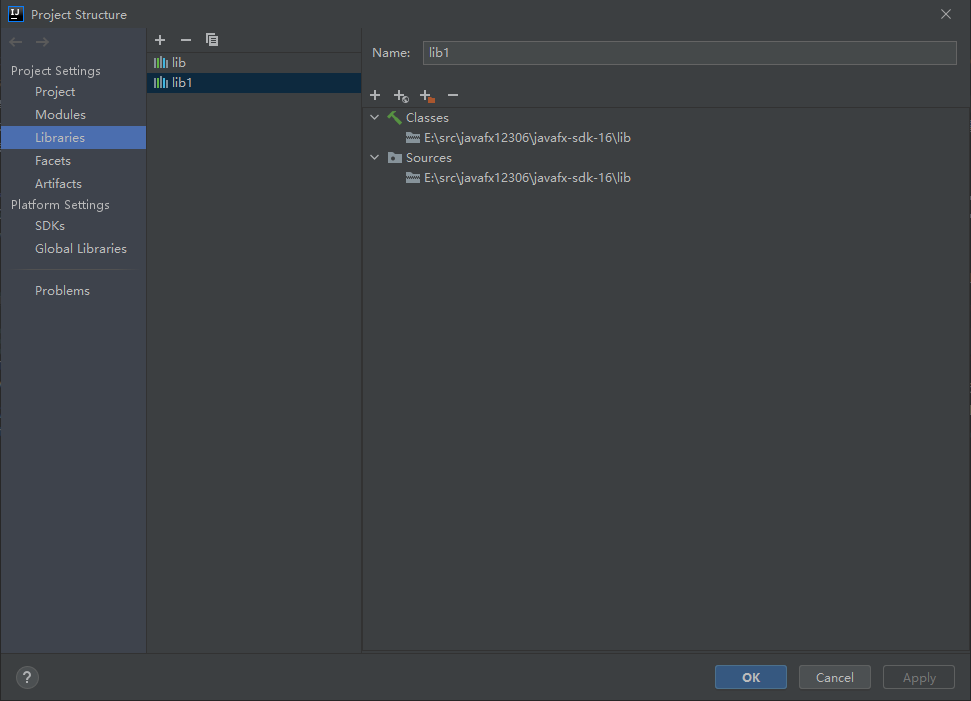

# 介绍
基于JavaFX的桌面应用。调用12306官方API实现车票余票查询。支持车站过滤搜索

# 版本
- JDK:13
- javafx:16

# 安装
- 下载
> $ git clone https://gitee.com/wufeiwua/javafx12306.git

- 运行`org.jfx12306.Main`

# 我遇到的问题
1. `Graphics Device initialization failed for :  d3d, sw
  Error initializing QuantumRenderer: no suitable pipeline found...`
2. `错误: 缺少 JavaFX 运行时组件, 需要使用该组件来运行此应用程序`

# 网上解决方式
1. `https://openjfx.io/openjfx-docs/` 官方方式
2. 网上流传新建一个`Main`方法。然后用 `Application.launch(Class<? extends Application> , String... )`
3. 设置启动参数 `--module--path $PATH_TO_FX$...`
4. 等等诸多方法我都试过。换汤不换药，没用！！！只要重新加载一次 lib 还是会出现

# 我如何解决的(IDE版本：IDEA-2021.1 Windows10_64)
- 换用 JDK1.8 或者其他低版本
- 依然无法根本解决法。这样很有效果，之后多次重启IDE不会再出现
  1. 把 `javafx-sdk-16` 删除
  2. 删除 Project Structure | Libraries 导入的 lib
   
  3. 将 `javafx-sdk-16` 复制进来然后再重新添加 `javafx-sdk-16/lib`
- 希望官方早点解决